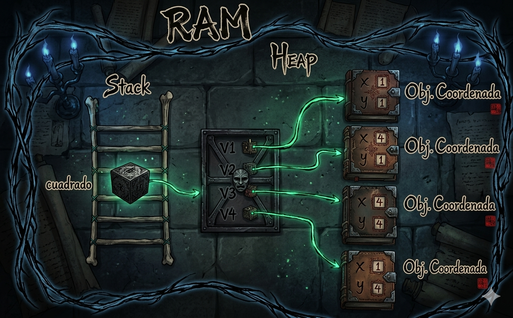

# POO en python
- introduccion a la Programacion con Orientada a Objetos (POO) en python

## ¿porque aprender POO?

- Imagina que quieres crear un videojuego. Tienes guerreros, magos, dragones... cada unio con sus propios puntos de vida, ataques, y habilidades. ¿ Como los organizo en codigo sin repetir todo una y otra vez?

- La **Programacion Orientada a Objetos (POO)** es la respuesta. En lugar de escribir instrucciones sueltas, modelas el mundo real con *objetos* que tienen caracteristicas y comportamientos. Es la forma en que estan construidos la mayoria de los programas profesionales del mundo 


## Clase y objeto

- Un clase es un tipo de dato cullas variables se llaaman objetos o instancias.

- La clase es la definicion de concepto del mundo real y los objeto o instancias son el propio "objeto" del mundo real 

- Las clases estan compuestas por dos elementos:
    - **Atributos:** Informacion que almacena la clase 
    -**Metodos:** Operaciones que pueden realizarse con la clase

## Definicion de una clase en python 

```PY
class Nombreclass:

    def__init__(self, variable1,variable2):
        self.atributo1= valor1
        self.atributo2= valor2

    def nombreMetodo(self):
        bloquecodigo
```

- `Class`: Palabra reservada en python para definir una clase
- `NombreClase`: Nombre de la clase que se quiere crear
- `def`: palabra reservada en python que se utiliza para definir tanto el constructor de la clase (Metodo que se ejecuta la primera vez que buscas una clase) como los diferentes metodos que tiene
- `__init__`:palabra reservada en python para definir el metodo constructor de la clase. El metodo `__init__` es lo primero que se ejecuta cuando creas un objeto de una clase .
- `(self, variableX)`:parametro del constructor de la clase, el parametro `self` es obligatorio y despues puedes tener tantos parametros como quieras. La forma de añadir parametros es la misma que en las funciones
- `self.AtributoX`:forma de utilizacion uy acceso a los atributos de la clase
- `nombremetodo`: Nombre de metodo de la clase 
- `self`: parametro del metodo, el parametro `self`es obligatorio y despues puedes tener tantos parametros como quieras. La forma de medir parametros es la misma que en las funciones 
- `bloquecodigo`:instrucciones que ejecutara el metodo

**Al definir una clase tenga en cuenta:**
- Puedes definir tantos aatributos como necesites
- Puedes definir tantos meetodos como necesites
- Pueddes definir tantos parametros el constructor y los metodos como necesites 

## Ejemplo 1

- crear una calse que represente una persona 
- atributos: nombre, apellidos y edad
- metodos:mostrar informacion de la personas

### Codigo

```PY
class Persona:

    # Metodo constructor de la clase
    def__init__(self,nombre,apellidos,eda):
        self.nombre= nombre
        self.apellidos= apellidos
        self.edad= edad

    #  
    def mostrarpersona(self):
        print("nombre: ",self.nombre)
        print("apellidos: "self.apellidos)
        print("edad: "self.edad)

def main():
    print("vamos a aprender POO...")
    Persona_1 = Persona("Lorenzo", "Perez", 18)
    Persona_1.mostrarpersona()

if __name__ == "__main__":
    main()
```

## Representacion en RAM del objeto creado


## Composicion 

- Consiste en la creacion de nuevas clases a partir de otras clases ya existentes que actuan como elementos compositores de la nueva 
- Las clases existentes ser0an atributos de la nueva clase

### Ejemplo 

- Una coordenada en dos dimensiones esta compuesta por dos valores, el valor en el eje de las **X** y el valor en el eje de las **y**, esto podria ser una clase
- Un cuadrado esta compuesto por cuatro coordenadas que son los cuatro vertices. Esto podria ser una clase que esta compuesta por cuatro clases del objeto coordenada

### Codigo python
```Py
class coordenada:
    # Metodo constructor
    def__init__(self, x, y):
        self.x = x
        self.y = y

    def mostrarcoordenada(self):
        print("(",self.x,",",self.y,")")

class Cuadrado:
    def__init__(self,v1,v2,v3,v4)
    self.v1 = v1
    self.v2 = v2
    self.v3 = v3
    self.v4 = v4

    def mostrarvertices(self):
        print("el cuadrado esta compuesto por los siguientes vertices:")
        self.v1.mostrarcoordenada()
        self.v2.mostrarcoordenada()
        self.v3.mostrarcoordenada()
        self.v4.mostrarcoordenada()
```
### Representacion de el ejercicio




## Encapsulacion

- Uno de los objetivos que tiene la POO es proteger los datos de acceso o uso no controlados, y esto es lo que se conoce como **Encapsulacion**
- los datos (atributos) que componen una clase pueden ser de dos tipos:
    -**Publicos:**Los datos son accesibles sin control es decir pueden ser utilizados sin ningun tipo de mecanismo que protega ante usos no autorizados o indebidos
    - **Privados:**Los datos no pueden se accedidos sin control y para acceder a ellos se debera implementar un metodo que acceda a ellos.  De esta manera, los datos unicamente seran accedidos directamente por la propia clase 
- La encapsulacion tambien puede realizarse sobre los metodos
- La definicion de atributos privados se realiza incluyendo los caracteres "__" (dos guiones de piso) entre la palabra **self** y el nombre de el atributo

### Ejemplo

### Codigo python
```Py
class coordenada:
    # Metodo constructor
    def__init__(self, x, y):
        self.__x = x
        self.__y = y

    # Metodo de acceso 
    def getX(self):
        return self.__x

    def setX(self,X):
        self.__X = X

    def getY(self):
        return self.__Y

    def setY(self, Y):
        self.__Y = Y

    def mostrarcoordenada(self):
        print("(",self.__x,",",self.__y,")")

class Cuadrado:
    def__init__(self,v1,v2,v3,v4)
    self.v1 = v1
    self.v2 = v2
    self.v3 = v3
    self.v4 = v4

    def mostrarvertices(self):
        print("el cuadrado esta compuesto por los siguientes vertices:")
        self.v1.mostrarcoordenada()
        self.v2.mostrarcoordenada()
        self.v3.mostrarcoordenada()
        self.v4.mostrarcoordenada()
```
