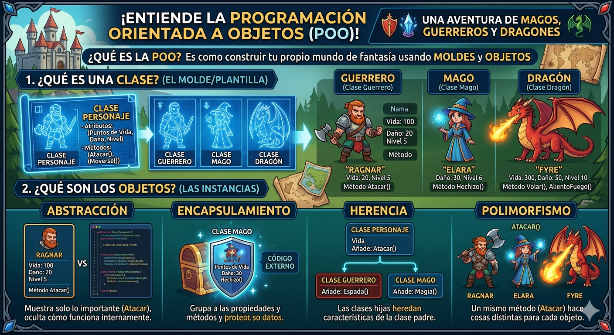

# POO en python
- introduccion a la Programacion con Orientada a Objetos (POO) en python

## ¿porque aprender POO?

- Imagina que quieres crear un videojuego. Tienes guerreros, magos, dragones... cada unio con sus propios puntos de vida, ataques, y habilidades. ¿ Como los organizo en codigo sin repetir todo una y otra vez?

- La **Programacion Orientada a Objetos (POO)** es la respuesta. En lugar de escribir instrucciones sueltas, modelas el mundo real con *objetos* que tienen caracteristicas y comportamientos. Es la forma en que estan construidos la mayoria de los programas profesionales del mundo 



## Clase y objeto

- Un clase es un tipo de dato cullas variables se llaaman objetos o instancias.

- La clase es la definicion de concepto del mundo real y los objeto o instancias son el propio "objeto" del mundo real 

- Las clases estan compuestas por dos elementos:
    - **Atributos:** Informacion que almacena la clase 
    -**Metodos:** Operaciones que pueden realizarse con la clase

## Definicion de una clase en python 

```PY
class Nombreclass:

    def__init__(self, variable1,variable2):
        self.atributo1= valor1
        self.atributo2= valor2

    def nombreMetodo(self):
        bloquecodigo
```

- `Class`: Palabra reservada en python para definir una clase
- `NombreClase`: Nombre de la clase que se quiere crear
- `def`: palabra reservada en python que se utiliza para definir tanto el constructor de la clase (Metodo que se ejecuta la primera vez que buscas una clase) como los diferentes metodos que tiene
- `__init__`:palabra reservada en python para definir el metodo constructor de la clase. El metodo `__init__` es lo primero que se ejecuta cuando creas un objeto de una clase .
- `(self, variableX)`:parametro del constructor de la clase, el parametro `self` es obligatorio y despues puedes tener tantos parametros como quieras. La forma de añadir parametros es la misma que en las funciones
- `self.AtributoX`:forma de utilizacion uy acceso a los atributos de la clase
- `nombremetodo`: Nombre de metodo de la clase 
- `self`: parametro del metodo, el parametro `self`es obligatorio y despues puedes tener tantos parametros como quieras. La forma de medir parametros es la misma que en las funciones 
- `bloquecodigo`:instrucciones que ejecutara el metodo

**Al definir una clase tenga en cuenta:**
- Puedes definir tantos aatributos como necesites
- Puedes definir tantos meetodos como necesites
- Pueddes definir tantos parametros el constructor y los metodos como necesites 